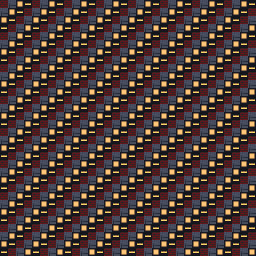

# CONCRETE KINGS: THE BLOCK CHRONICLES
## Master Pixel Art & Gameplay Pipeline Engine



Welcome to the production repository for **Concrete Kings: The Block Chronicles** — a Black narrative RPG card game built with a 320x180 native pixel art engine, 101-color master palette organised as nine tone ramps, real-time city theme palette swapping, Web Audio chiptunes, and WebSocket multiplayer sync.

---

## 🎨 Core Pipeline Standards

- **Master Native Resolution:** `320 × 180` pixels (Aspect Ratio: `16:9`).
- **Tile Grid Standard:** `16 × 16` pixels.
- **Character Grid Standard:** `32 × 32` pixels (`32 × 48` for tall hero variants).
- **Master Palette:** 101 colors as nine tone ramps (greys, brick, earth, azure, teal, green, violet, skin, skinShade). Every adjacent pair is within CIELAB dE 12, so `paletteShift(colour, +/-1)` is always one shade rather than a change of hue. Generated to JSON by `scripts/generate-palette-json.js`; all 64 colors of the original palette are still present at their original ramp positions.
- **Animation Budget:** Maximum 4 frames per animation (`00`, `01`, `02`, `03`).
- **Asset Size Budget:** Under 2.0 MB total.

---

## 📁 Repository Directory Architecture

```
concrete-kings/
├── pixel-art-implementation-plan.md  # Complete 14-section art & pipeline plan
├── pixel-art-demo.html               # Interactive 320x180 canvas & city swapper demo
├── index.html                        # Main HTML5 game client & canvas engine
├── package.json                      # NPM test script configuration
├── assets/
│   ├── palettes/
│   │   └── concrete_kings.json    # Master palette, generated from pixel-engine.js
│   └── atlases/
│       ├── master_tiles_atlas.png    # 8-bit Indexed PNG Tilemap Atlas
│       ├── characters_atlas.png      # 8-bit Indexed PNG Character Sprite Atlas
│       └── cards_atlas.png           # 8-bit Indexed PNG Card Backdrop Atlas
├── godot/                            # Godot 4.x Engine Setup
│   ├── project.godot                 # Viewport & Nearest-neighbor stretch settings
│   ├── shaders/
│   │   └── palette_swap.gdshader     # Real-time GPU palette swap fragment shader
│   └── scripts/
│       ├── PixelPerfectCamera.gd     # Integer scaling camera controller
│       ├── PaletteManager.gd         # City theme palette swapper
│       ├── BlockTileMap.gd           # Layered tilemap setup
│       └── AtlasLoader.gd            # Sub-texture atlas region loader
├── scripts/
│   ├── aseprite/
│   │   ├── generate_variants.lua     # Aseprite 8-city palette variant generator
│   │   ├── pack_spritesheets.lua     # Aseprite 2048x2048 atlas packer
│   │   └── optimize_palette.lua      # Aseprite 64-color palette optimizer
│   └── generate_procedural_atlases.js# Zero-dependency Node.js 8-bit PNG atlas builder
├── src/
│   └── pixel_engine/
│       ├── pixel-engine.js           # HTML5 320x180 Integer Scaling & Sprite Engine
│       ├── pixel-engine.css          # Pixel-crisp CSS rendering rules
│       ├── card-visual-system.js     # 8 Card categories & 4-frame gold shimmer
│       ├── weather-effects-system.js # Rain, sidewalk ripples, steam plumes, sirens
│       ├── block-map-navigation.js   # Walkable character controller & stoop triggers
│       └── audio-sfx-engine.js       # Web Audio API chiptune SFX synthesizer
├── server/
│   └── server.js                     # Node.js + WebSocket server (Avatar & City Sync)
└── test/                             # Node Test Runner Suite (38 tests)
    ├── pixel-engine.test.js
    ├── card-visual-system.test.js
    ├── weather-effects-system.test.js
    ├── block-map-navigation.test.js
    ├── audio-sfx-engine.test.js
    ├── atlases.test.js
    └── server-avatar-sync.test.js
```

---

## ⚡ Quick Start & Commands

### 1. Run Automated Test Suite
```bash
npm test
```
Runs 38 unit & integration tests covering client JS syntax, server JS syntax, integer scaling math, card categorization, 4-frame animation budgets, weather particles, audio triggers, texture atlas signatures, and WebSocket message handlers.

### 2. Generate Procedural Texture Atlases
```bash
node scripts/generate_procedural_atlases.js
```
Generates 8-bit indexed PNG texture atlases in `assets/atlases/`.

### 3. Launch Local Server
```bash
node server/server.js
```
Starts the Concrete Kings server at `http://localhost:3001`.

### 4. Interactive Browser Demo
Open `pixel-art-demo.html` in any browser to test real-time 320x180 integer scaling, 8 city themes, character walking, and weather effects.

---

## 🌍 City Theme Palette Overrides

| City Theme | Primary Architecture | Red Brick Swap (`#7A1D1C`) | Concrete Swap (`#474D5E`) | Ambient Vibe |
| :--- | :--- | :--- | :--- | :--- |
| **Harlem** | Historic Brownstone | `#6B341D` (Deep Mahogany) | `#C9822B` (Polished Brass) | Heritage Gold |
| **Detroit** | Industrial Steel | `#4D1414` (Rust Mahogany) | `#2D313D` (Industrial Metal) | Cold Industrial |
| **Chicago** | Greystone & 2-Flat | `#565E70` (Slate Gray) | `#181920` (Dark Charcoal) | Wind-swept Slate |
| **Miami** | Art Deco Neon | `#6FE8D8` (Pastel Cyan) | `#F25438` (Neon Pink) | Tropical Neon |
| **Baltimore** | Formstone & Marble | `#FFCD68` (Formstone Tan) | `#101116` (Gloss Black) | Warm Ochre |
| **Atlanta** | Brick Craftsman | `#AA2724` (Red Clay) | `#174540` (Lush Pine) | Forest Warmth |
| **Oakland** | Victorian Bay | `#339488` (Weathered Teal) | `#FF7A45` (Sunset Blaze) | Bay Sunset |
| **NOLA** | French Quarter Iron | `#D97843` (Aged Stucco) | `#246961` (Emerald Iron) | Moist Moss |

---

## 🎮 Controls
- **Movement:** WASD or Arrow Keys
- **Interaction:** Enter at Stoop / Bodega / Park hotspots
- **Card Action:** Click cards to select/play (Triggers 80ms chiptune flip & gold shimmer sweep)
